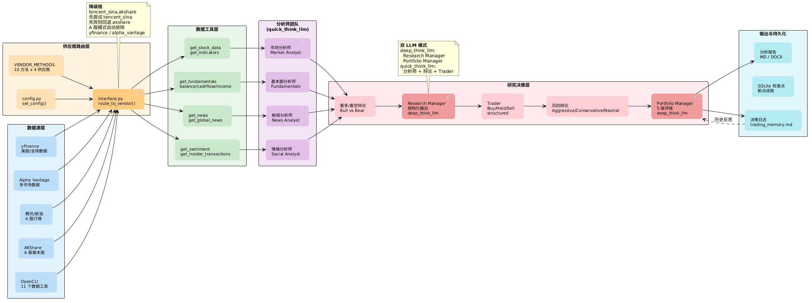
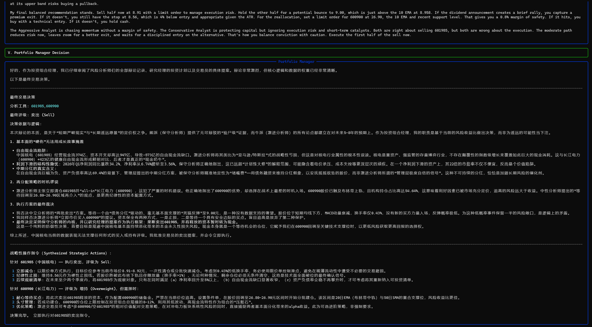
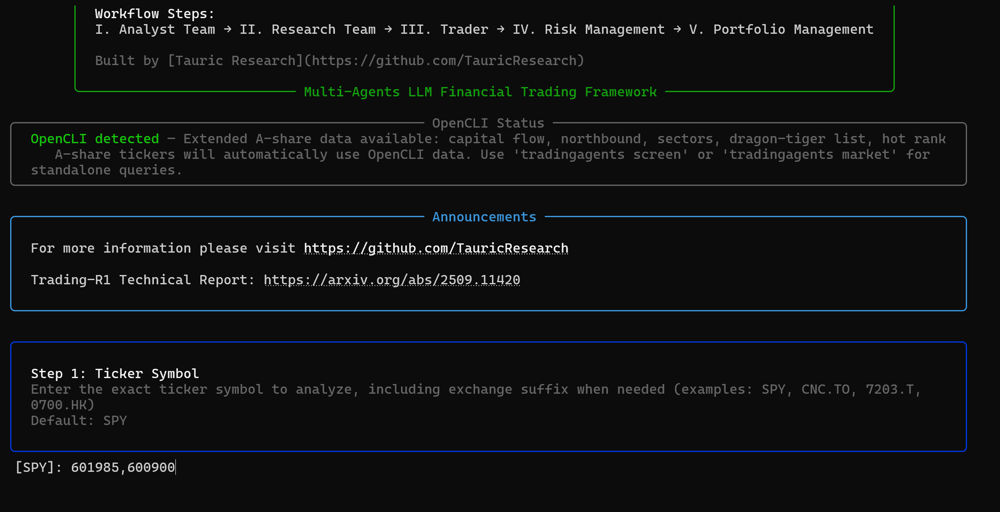
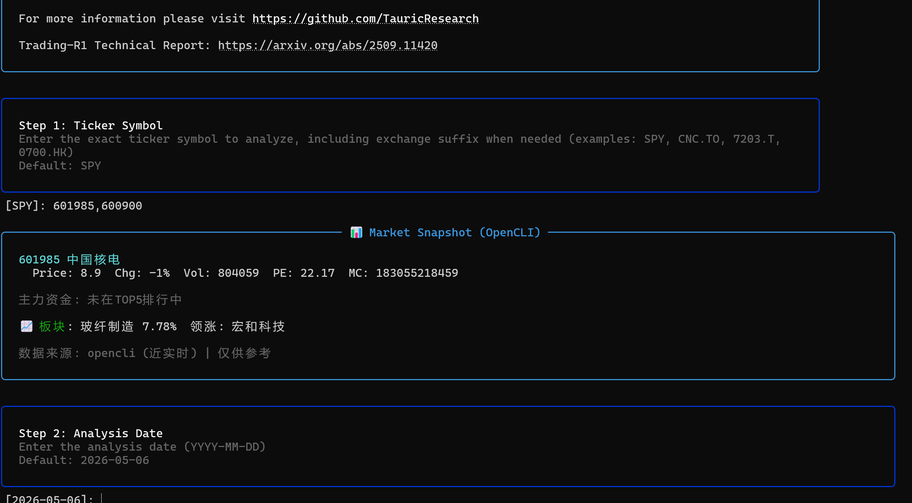
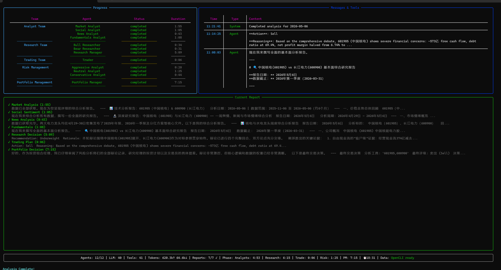

<p align="center">
  
</p>

<div align="center" style="line-height: 1;">
  <a href="https://arxiv.org/abs/2412.20138" target="_blank"></a>
  <a href="https://discord.com/invite/hk9PGKShPK" target="_blank"></a>
  <a href="./assets/wechat.png" target="_blank"></a>
  <a href="https://x.com/TauricResearch" target="_blank"></a>
  <br>
  <a href="https://github.com/TauricResearch/" target="_blank"></a>
</div>

<div align="center">
  <!-- Keep these links. Translations will automatically update with the README. -->
  <a href="https://www.readme-i18n.com/TauricResearch/TradingAgents?lang=de">Deutsch</a> | 
  <a href="https://www.readme-i18n.com/TauricResearch/TradingAgents?lang=es">Español</a> | 
  <a href="https://www.readme-i18n.com/TauricResearch/TradingAgents?lang=fr">français</a> | 
  <a href="https://www.readme-i18n.com/TauricResearch/TradingAgents?lang=ja">日本語</a> | 
  <a href="https://www.readme-i18n.com/TauricResearch/TradingAgents?lang=ko">한국어</a> | 
  <a href="https://www.readme-i18n.com/TauricResearch/TradingAgents?lang=pt">Português</a> | 
  <a href="https://www.readme-i18n.com/TauricResearch/TradingAgents?lang=ru">Русский</a> | 
  <a href="https://www.readme-i18n.com/TauricResearch/TradingAgents?lang=zh">中文</a>
</div>

---

# TradingAgents：多智能体 LLM 金融交易框架

## 更新动态

* [2026-05] 增加支持股票数据映射QLIB数据转换功能
* [2026-05] Fork 源项目增加对 **A 股支持** — 完整的 A 股市场分析，集成 tencent_sina/akshare/tushare 数据供应商（tushare 提供日线行情、PE/PB/市值指标、全部财务报表），增加twelve data 数据供应商，增加[OpenCLI](https://www.npmjs.com/package/@jackwener/opencli) （需安装OpenCLI）提供 11 个数据工具（行情、K 线、资金流向、北向资金、板块、龙虎榜、热搜、指数面板、快讯、持仓、公告），支持中文股票代码自动识别、每个智能体的耗时统计面板、CLI 直接模式（`-t ticker` 跳过交互提示）、`screen` 候选股筛选和 `market` 实时数据命令，以及 CLI 中的流式报告展示。新增 `qlib bulk-download` 全市场批量下载（腾讯 K 线，真实复权因子）、OHLCV 缓存自动保存、UA 轮换反爬策略。



   


[2026-04] **TradingAgents v0.2.4** 发布，新增结构化输出智能体（Research Manager、Trader、Portfolio Manager）、LangGraph 检查点恢复、持久化决策日志、DeepSeek/Qwen/GLM/Azure 供应商支持、Docker 支持，以及 Windows UTF-8 编码修复。完整更新列表见 [CHANGELOG.md](CHANGELOG.md)。


[2026-03] **TradingAgents v0.2.3** 发布，新增多语言支持、GPT-5.4 系列模型、统一模型目录、回测日期精度，以及代理支持。


[2026-03] **TradingAgents v0.2.2** 发布，新增 GPT-5.4/Gemini 3.1/Claude 4.6 模型覆盖、五级评级体系、OpenAI Responses API、Anthropic effort control，以及跨平台稳定性改进。


[2026-02] **TradingAgents v0.2.0** 发布，新增多供应商 LLM 支持（GPT-5.x、Gemini 3.x、Claude 4.x、Grok 4.x）和改进的系统架构。


[2026-01] **Trading-R1** [技术报告](https://arxiv.org/abs/2509.11420) 发布，[Terminal](https://github.com/TauricResearch/Trading-R1) 即将上线。

<div align="center">
<a href="https://www.star-history.com/#TauricResearch/TradingAgents&Date">
 <picture>
   <source media="(prefers-color-scheme: dark)" srcset="https://api.star-history.com/svg?repos=TauricResearch/TradingAgents&type=Date&theme=dark" />
   <source media="(prefers-color-scheme: light)" srcset="https://api.star-history.com/svg?repos=TauricResearch/TradingAgents&type=Date" />
   
 </picture>
</a>
</div>

> 🎉 **TradingAgents** 正式发布！我们收到了大量关于这项工作的咨询，感谢社区的广泛关注与热情。
>
> 因此我们决定将框架完全开源。期待与大家一起打造有影响力的项目！

<div align="center">

🚀 [TradingAgents 框架](#tradingagents-framework) | ⚡ [安装与 CLI](#installation-and-cli) | 🎬 [演示](https://www.youtube.com/watch?v=90gr5lwjIho) | 📦 [包使用](#tradingagents-package) | 🤝 [贡献](#contributing) | 📄 [引用](#citation)

</div>

## TradingAgents 框架

TradingAgents 是一个多智能体交易框架，模拟了真实交易公司的运作方式。通过部署专业化的 LLM 智能体，从基本面分析师、情绪专家、技术分析师，到交易员和风险管理团队，平台协同评估市场状况并指导交易决策。此外，这些智能体通过动态讨论来确定最优策略。

<p align="center">
  
</p>

> TradingAgents 框架仅用于研究目的。交易表现可能因多种因素而异，包括所选的基础语言模型、模型温度、交易周期、数据质量以及其他非确定性因素。[本框架不构成金融、投资或交易建议。](https://tauric.ai/disclaimer/)

我们的框架将复杂的交易任务分解为专业化的角色。这确保了系统在市场分析和决策制定方面拥有稳健且可扩展的方法。

### 分析师团队

- 基本面分析师：评估公司财务状况和业绩指标，识别内在价值和潜在风险信号。
- 情绪分析师：使用情绪评分算法分析社交媒体和公众情绪，衡量短期市场情绪。
- 新闻分析师：监控全球新闻和宏观经济指标，解读事件对市场状况的影响。
- 技术分析师：运用技术指标（如 MACD 和 RSI）检测交易模式并预测价格走势。

<p align="center">
  
</p>

### 研究员团队

- 由看涨和看跌研究员组成，他们批判性地评估分析师团队提供的洞察。通过结构化的辩论，他们权衡潜在收益与固有风险。

<p align="center">
  
</p>

### 交易智能体

- 综合分析师和研究员的报告，做出明智的交易决策。它基于全面的市场洞察来确定交易的时机和规模。

<p align="center">
  
</p>

### 风险管理与投资组合经理

- 通过评估市场波动性、流动性及其他风险因素，持续评估投资组合风险。风险管理团队评估并调整交易策略，向投资组合经理提供评估报告以供最终决策。
- 投资组合经理批准或拒绝交易提案。如果批准，订单将发送到模拟交易所并执行。

<p align="center">
  
</p>

## 安装与 CLI

### 安装

克隆 TradingAgents：

```bash
git clone https://github.com/TauricResearch/TradingAgents.git
cd TradingAgents
```

在你喜欢的环境管理器中创建虚拟环境：

```bash
conda create -n tradingagents python=3.13
conda activate tradingagents
```

安装包及其依赖：

```bash
pip install .
```

### Docker

也可以使用 Docker 运行：

```bash
cp .env.example .env  # add your API keys
docker compose run --rm tradingagents
```

使用 Ollama 运行本地模型：

```bash
docker compose --profile ollama run --rm tradingagents-ollama
```

### API Key 配置

TradingAgents 支持多个 LLM 供应商。设置你所选供应商的 API Key：

```bash
export OPENAI_API_KEY=...          # OpenAI (GPT)
export GOOGLE_API_KEY=...          # Google (Gemini)
export ANTHROPIC_API_KEY=...       # Anthropic (Claude)
export XAI_API_KEY=...             # xAI (Grok)
export DEEPSEEK_API_KEY=...        # DeepSeek
export DASHSCOPE_API_KEY=...       # Qwen (Alibaba DashScope)
export ZHIPU_API_KEY=...           # GLM (Zhipu)
export OPENROUTER_API_KEY=...      # OpenRouter
export ALPHA_VANTAGE_API_KEY=...   # Alpha Vantage
export TWELVE_DATA_API_KEY=...    # Twelve Data
export TUSHARE_API_KEY=...        # Tushare Pro (需 pip install tushare)
```

对于企业级供应商（如 Azure OpenAI、AWS Bedrock），将 `.env.enterprise.example` 复制为 `.env.enterprise` 并填入你的凭证。

对于本地模型，在配置中将 `llm_provider` 设置为 `"ollama"`。

或者，将 `.env.example` 复制为 `.env` 并填入你的 Key：

```bash
cp .env.example .env
```

### CLI 使用

启动交互式 CLI：

```bash
tradingagents          # installed command
python -m cli.main     # alternative: run directly from source
```

你将看到一个界面，可以选择目标股票代码、分析日期、LLM 供应商、研究深度等。

CLI 会实时显示进度，包括每个智能体的耗时统计、流式报告以及底部的阶段级别分解。

<p align="center">
  
</p>

界面会随着结果的加载实时展示，让你可以跟踪智能体的运行进度。

<p align="center">
  
</p>

<p align="center">
  
</p>

#### 直接模式（跳过交互提示）

通过命令行参数直接指定股票代码和分析配置，跳过交互式 TUI：

```bash
tradingagents -t 000858.SZ                                # 最简：只传 ticker
tradingagents -t NVDA -d 2026-01-15                       # 指定日期
tradingagents -t 000858 -p deepseek --depth 2             # 指定供应商和深度
tradingagents -t 000858 -l Chinese -y                     # 自动保存，无交互提示
python -m cli.main -t 000858.SZ -y                        # 源码直接运行
tradingagents -t ci -p deepseek --depth 3 -l Chinese -y   # 美股，看多/看空辩论 3 轮，报告输出中文（内部辩论仍英文），非交互模式，自动保存报告
```

| 参数           | 简写   | 说明                                                                                |
| -------------- | ------ | ----------------------------------------------------------------------------------- |
| `--ticker`   | `-t` | 股票代码（必填，传入后进入直接模式）                                                |
| `--date`     | `-d` | 分析日期（YYYY-MM-DD），默认今天                                                    |
| `--provider` | `-p` | LLM 供应商：deepseek, openai, google, anthropic, xai, qwen, glm, openrouter, ollama |
| `--depth`    |        | 研究深度/辩论轮次（1-3，默认 1）                                                    |
| `--lang`     | `-l` | 输出语言（English, Chinese 等）                                                     |
| `--analysts` | `-a` | 指定分析师（逗号分隔）：market,social,news,fundamentals                             |
| `--yes`      | `-y` | 非交互模式：自动保存报告并输出结果                                                  |

其他全局选项：`--checkpoint`（断点续跑）、`--clear-checkpoints`（重置检查点）、`--diag`（诊断模式，写入 `.cli_diag.log` 执行追踪）。

#### screen — 候选股筛选

使用 OpenCLI 从多个数据源筛选候选股票池（需已安装 opencli）：

```bash
# 涨跌幅排行（东方财富）
tradingagents screen --source eastmoney --mode rank --limit 20

# 主力资金流向
tradingagents screen -s eastmoney -m money-flow -l 10

# 板块排名
tradingagents screen -s eastmoney -m sectors

# 热度排行
tradingagents screen -s eastmoney -m hot -l 15
tradingagents screen -s tdx -m hot       # 通达信热度
tradingagents screen -s sinafinance -m rank  # 新浪涨跌排行
```

支持的筛选模式：

| 数据源          | 可用模式                       | 说明                                     |
| --------------- | ------------------------------ | ---------------------------------------- |
| `eastmoney`   | rank, money-flow, sectors, hot | 东方财富：涨跌排行、主力资金、板块、热度 |
| `sinafinance` | rank                           | 新浪财经：涨跌排行                       |
| `tdx`         | hot                            | 通达信：热度排行                         |
| `ths`         | hot                            | 同花顺：热度排行                         |

输出格式：`--format table`（默认）、`json`、`csv`、`markdown`。

#### market — 透传 OpenCLI 命令

直接调用任意 OpenCLI 金融数据命令，获取实时市场数据：

```bash
tradingagents market eastmoney quote 600519              # 实时行情
tradingagents market eastmoney kline 000858.SZ -f json   # K 线数据
tradingagents market eastmoney rank --limit 10           # 涨跌排行
tradingagents market eastmoney money-flow --limit 5      # 主力资金
tradingagents market eastmoney longhu 002876             # 龙虎榜
tradingagents market eastmoney northbound --limit 10     # 北向资金
tradingagents market tdx hot-rank --limit 10             # 热度排行
tradingagents market binance price BTCUSDT -f json       # 加密货币
```

选项：`--format/-f`（table/json/csv/markdown/yaml）、`--limit/-l`（返回数量）、`--verbose/-v`（显示详细输出）。

#### report — 生成 Word 报告

将已保存的分析结果目录（含 MD 文件）转换为专业 Word 文档：

```bash
tradingagents report reports/NVDA_20260115_120000
tradingagents report reports/NVDA_20260115_120000 -o analysis.docx
tradingagents report reports/000858_20260506_143000 -t 000858.SZ -d 2026-05-06
```

| 选项            | 说明                                                       |
| --------------- | ---------------------------------------------------------- |
| `report_dir`  | 报告目录路径（必需参数）                                   |
| `--output/-o` | 输出 .docx 路径（默认 `<report_dir>/综合分析报告.docx`） |
| `--ticker/-t` | 封面页股票代码（默认从目录名自动检测）                     |
| `--date/-d`   | 封面页分析日期（默认自动检测）                             |

#### qlib — Qlib 数据转换

将已缓存的 OHLCV 数据和 AI 分析信号转换为 [Qlib](https://github.com/microsoft/qlib) 二进制格式，用于量化模型训练和回测。**无需安装 qlib 依赖**——转换使用纯 numpy 写入 Qlib 兼容的二进制文件。

##### 五步流程

```bash
# 0. 批量下载（可选）— 从东方财富获取全市场 A 股列表，通过腾讯 K 线 API 下载 OHLCV
tradingagents qlib bulk-download                           # 全市场 A 股（跳过已缓存）
tradingagents qlib bulk-download -t 000858.SZ,600519.SH   # 指定股票
# A 股分析时 OHLCV 也会自动缓存，此步骤用于批量预下载

# 1. 扫描缓存 — 查看有哪些 OHLCV 数据可用
tradingagents qlib scan                              # 查看全部
tradingagents qlib scan -t 000858.SZ                 # 指定股票

# 2. 转换 — OHLCV 缓存 → Qlib 二进制
tradingagents qlib convert                           # 全部缓存 → Qlib 二进制
tradingagents qlib convert -t 000858.SZ,600036.SH   # 指定股票
tradingagents qlib convert --with-signals            # 含 AI 分析信号
tradingagents qlib convert -t 688041.SH --with-signals  # 指定 + 信号
tradingagents qlib convert -o /path/to/output        # 自定义输出目录

# 3. 回填信号 — 从历史分析日志提取 AI 信号（独立于 convert）
tradingagents qlib backfill-signals                  # → signals.parquet

# 4. 推送 DoltHub — 缓存数据同步到版本化 SQL 数据库
tradingagents qlib dolt-push                         # 全部缓存 → DoltHub
tradingagents qlib dolt-push -t 000858.SZ,600519.SH # 指定股票
tradingagents qlib dolt-push --no-push               # 仅本地提交，不推送
```

| 选项               | 说明                                                                              |
| ------------------ | --------------------------------------------------------------------------------- |
| `action`         | 操作：`scan`（扫描缓存）、`convert`（转换）、`backfill-signals`（提取信号）、`bulk-download`（批量下载 A 股 OHLCV）、`dolt-push`（推送 DoltHub） |
| `--ticker/-t`    | 指定股票代码（不指定则处理全部缓存/全市场）                                       |
| `--output/-o`    | 输出目录（默认 `~/.qlib/qlib_data/tradingagents`）                              |
| `--with-signals` | convert 时同时合并 AI 分析信号                                                    |
| `--freq`         | 数据频率（默认 `day`）                                                          |
| `--no-push`      | dolt-push 时仅本地提交，不推送到 DoltHub                                          |
| `--chunk-size`   | dolt-push 时每 CSV 分块行数（默认 500,000）                                      |
| `--keep-tmp`     | dolt-push 时保留临时目录（调试用）                                               |

##### 数据流

```
东方财富 API / 指定列表       →  bulk-download  →  ~/.tradingagents/cache/
  全市场 A 股代码                                    {TICKER}-Tencent-data-*.csv
  (腾讯 K 线 API, 真实复权因子)                       (OHLCV + Adj Close)

~/.tradingagents/cache/           →  convert  →  ~/.qlib/qlib_data/tradingagents/
  {TICKER}-Tencent-data-*.csv        calendars/day.txt
  {TICKER}-YFin-data-*.csv           instruments/all.txt
                                     features/{inst_lower}/{field}.day.bin

~/.tradingagents/logs/            →  backfill →  ~/.qlib/qlib_data/tradingagents_signals.parquet
  {TICKER}/.../full_states_log_*.json
```

转换输出 6 个基础特征：`open`, `high`, `low`, `close`, `volume`, `factor`（`factor = Adj Close / Close`）。加 `--with-signals` 后额外输出 4 个 AI 信号特征：

| 特征                | 类型  | 量程     | 来源              | 说明                                                 |
| ------------------- | ----- | -------- | ----------------- | ---------------------------------------------------- |
| `ai_score`        | int   | -2 ~ +2  | Portfolio Manager | Buy=2, Overweight=1, Hold=0, Underweight=-1, Sell=-2 |
| `trader_action`   | int   | -1 ~ +1  | Trader            | Buy=1, Hold=0, Sell=-1                               |
| `research_rating` | int   | -2 ~ +2  | Research Manager  | 同 ai_score 量程                                     |
| `price_target`    | float | NaN ~ ∞ | Portfolio Manager | 目标价（大多数日期为 NaN，仅分析过的那天有值）       |

##### Python API

```python
from tradingagents.qlib.converter import QlibConverter
from tradingagents.qlib.signal_extractor import extract_from_state, batch_extract_from_logs

# 方式 0：批量下载 OHLCV（全市场或指定股票）
from tradingagents.qlib.bulk_downloader import bulk_download, fetch_stock_universe
result = bulk_download(tickers=["000858.SZ", "600519.SH"])  # 指定股票
print(f"Downloaded: {result.downloaded}, Skipped: {result.skipped}, Failed: {result.failed}")
# 或下载全市场（从东方财富 API 获取股票池）
# result = bulk_download()  # 跳过已缓存，自动速率控制

# 方式 1：从缓存转换（不含信号）
converter = QlibConverter("~/.qlib/qlib_data/tradingagents", freq="day")
result = converter.convert_from_cache(tickers=["000858.SZ"])
print(result.num_instruments, result.feature_names)

# 方式 2：含 AI 信号
signals_df = batch_extract_from_logs()  # 先提取信号
extra_features = {}
for symbol, group in signals_df.groupby("symbol"):
    extra_features[symbol] = group.drop(columns=["symbol"])
result = converter.convert_from_cache(tickers=["000858.SZ"], extra_features=extra_features)

# 方式 3：从分析结果直接提取信号
from tradingagents.graph.trading_graph import TradingAgentsGraph
from tradingagents.default_config import DEFAULT_CONFIG
ta = TradingAgentsGraph(debug=True, config=DEFAULT_CONFIG.copy())
state, decision = ta.propagate("000858.SZ", "2026-05-06")
signals = extract_from_state(state)
# {'date': '2026-05-06', 'symbol': 'SZ000858', 'ai_score': 0, 'trader_action': -1, ...}

# 方式 4：从任意 DataFrame 转换
import pandas as pd
df = pd.read_csv("my_data.csv")  # 必须有 date, symbol 列
result = converter.convert_from_dataframe(df, feature_cols=["close", "volume"])

# 保存信号 parquet
from tradingagents.qlib.signal_extractor import save_signals_parquet
signals_df = batch_extract_from_logs()
save_signals_parquet(signals_df, "~/.qlib/qlib_data/tradingagents_signals.parquet")
```

##### 在 Qlib 中使用

```python
import qlib
from qlib.data import D

# 加载 TradingAgents 生成的数据
qlib.init(
    provider_uri="~/.qlib/qlib_data/tradingagents",
    region="cn",
)

# 读取行情数据
df = D.features(
    instruments=["SH688041"],
    fields=["$open", "$close", "$volume"],
    start_time="2024-01-01",
    end_time="2026-05-08",
)

# 读取 AI 信号（需 --with-signals 生成）
signals = D.features(
    instruments=["SH688041"],
    fields=["$ai_score", "$trader_action", "$research_rating", "$price_target"],
    start_time="2024-01-01",
    end_time="2026-05-08",
)
```

> **注意**：Qlib 使用 `SH688041` 格式的标的名称（大写前缀），字段名需加 `$` 前缀（如 `$close`、`$ai_score`）。AI 信号仅在运行过分析的那天有值，其余日期为 NaN。

##### DoltHub 数据推送

将缓存数据推送到 [DoltHub](https://www.dolthub.com/repositories/rickqi/tradingagents) 版本化 SQL 数据库，支持 SQL 查询、数据版本管理和协作。直接从 `.tradingagents/cache` 读取，**无需先执行 Qlib 转换**。

**前置条件：**

```bash
winget install DoltHub.Dolt     # 安装 Dolt
dolt login                       # 认证 DoltHub 账号
```

**数据流：**

```
~/.tradingagents/cache/          →  dolt-push  →  DoltHub (rickqi/tradingagents)
  {TICKER}-Tencent-data-*.csv                      a_stock_eod_price
  {TICKER}-YFin-data-*.csv                         trade_calendar
  {TICKER}-AKShare-data-*.csv                      stock_list
```

**推送流程：** 缓存去重（每只股票选行数最多 + 日期最新的文件） → 生成 CSV → `dolt clone` → `dolt table import` → `dolt commit` → `dolt push`

**表结构与 Schema：**

**`a_stock_eod_price`** — 日 OHLCV 行情（主表）

| 列名       | 类型        | 约束      | 说明                                    |
| ---------- | ----------- | --------- | --------------------------------------- |
| `tradedate`  | DATE        | NOT NULL  | 交易日期（如 `2026-05-08`）             |
| `symbol`     | VARCHAR(20) | NOT NULL  | Qlib 格式标的代码（如 `SZ000858`）      |
| `open`       | DOUBLE      |           | 开盘价                                  |
| `high`       | DOUBLE      |           | 最高价                                  |
| `low`        | DOUBLE      |           | 最低价                                  |
| `close`      | DOUBLE      |           | 收盘价                                  |
| `volume`     | DOUBLE      |           | 成交量                                  |
| `adjclose`   | DOUBLE      |           | 复权收盘价（腾讯数据 = close，YFin 可不同） |
| `vendor`     | VARCHAR(20) |           | 数据源标识（`Tencent`、`YFin`、`AKShare`） |

> **主键**：`(tradedate, symbol)` — 每只股票每天一行

**`trade_calendar`** — 交易日历

| 列名        | 类型        | 约束      | 说明                   |
| ----------- | ----------- | --------- | ---------------------- |
| `trade_date` | VARCHAR(20) | NOT NULL  | 交易日期（`YYYY-MM-DD`） |
| `is_open`    | INT         |           | 是否交易日（固定为 1）  |

> **主键**：`trade_date`

**`stock_list`** — 标的列表

| 列名        | 类型        | 约束      | 说明                                  |
| ----------- | ----------- | --------- | ------------------------------------- |
| `symbol`     | VARCHAR(20) | NOT NULL  | Qlib 格式标的代码（如 `SH688041`）    |
| `start_date` | VARCHAR(20) |           | 该标的数据起始日期                    |
| `end_date`   | VARCHAR(20) |           | 该标的数据结束日期                    |
| `vendor`     | VARCHAR(20) |           | 数据源标识                            |

> **主键**：`symbol`

**Python API：**

```python
from tradingagents.qlib.dolt_publisher import dolt_push

# 推送全部缓存到 DoltHub
result = dolt_push()
print(f"{result.total_instruments} instruments, {result.total_rows:,} rows")

# 仅推送指定股票
result = dolt_push(tickers=["000858.SZ", "600519.SH"])

# 仅本地提交，不推送（调试用）
result = dolt_push(push=False, keep_tmp=True)
```

**在 DoltHub 上查询：**

推送后可直接在 https://www.dolthub.com/repositories/rickqi/tradingagents 使用 SQL 查询：

```sql
-- 查看某只股票最近 5 天行情
SELECT * FROM a_stock_eod_price
WHERE symbol = 'SZ000858'
ORDER BY tradedate DESC LIMIT 5;

-- 查看某天所有股票涨幅
SELECT symbol, open, close,
       ROUND((close - open) / open * 100, 2) AS change_pct
FROM a_stock_eod_price
WHERE tradedate = '2026-05-08'
ORDER BY change_pct DESC;

-- 查看标的列表和数据覆盖范围
SELECT * FROM stock_list ORDER BY symbol;

-- 查看交易日历
SELECT * FROM trade_calendar
WHERE trade_date >= '2026-01-01'
ORDER BY trade_date;
```

### A 股市场支持

TradingAgents 开箱即支持 **A 股（中国股票市场）分析**。输入任意中文股票代码，无论是纯 6 位数字（`000858`）、带交易所后缀（`000858.SZ`、`603208.SH`），还是逗号分隔的列表，框架都会自动切换到 tencent_sina（腾讯 K 线 + 新浪行情 + 东方财富）和 akshare（基本面、情绪）数据源。

```bash
# 交互模式 — 在 CLI 中输入：
tradingagents         # then enter: 000858.SZ
python -m cli.main    # then enter: 600519

# 直接模式 — 命令行指定 ticker：
tradingagents -t 000858.SZ -y
tradingagents -t 600519 -p deepseek --depth 2 -l Chinese -y
```

```python
# 或通过 Python API：
config = DEFAULT_CONFIG.copy()
config["data_vendors"] = {
    "core_stock_apis": "tencent_sina",
    "fundamental_data": "tencent_sina,akshare",
    "news_data": "tencent_sina",
    "sentiment_data": "akshare",
}
ta = TradingAgentsGraph(config=config)
_, decision = ta.propagate("000858.SZ", "2026-05-05")
```

### OpenCLI 集成（可选）

安装 [OpenCLI](https://www.npmjs.com/package/@jackwener/opencli) 可获得 11 个额外的 A 股数据工具，覆盖三个分析师：

```bash
npm install -g @jackwener/opencli
```

| Tool                 | Data Source            | Agent                | 说明                                            |
| -------------------- | ---------------------- | -------------------- | ----------------------------------------------- |
| `get_quote`        | eastmoney quote        | Market Analyst       | 实时行情：PE、PB、总市值、换手率等 16 个字段    |
| `get_kline`        | eastmoney kline        | Market Analyst       | K 线历史：可配置周期（日/周/月/分钟）和复权方式 |
| `get_money_flow`   | eastmoney money-flow   | Market Analyst       | 主力资金流向：机构净流入/流出                   |
| `get_northbound`   | eastmoney northbound   | Market Analyst       | 北向资金：沪港通/深港通外资流向                 |
| `get_sectors`      | eastmoney sectors      | Market Analyst       | 板块排名：行业/概念/地区多维度排序              |
| `get_longhu`       | eastmoney longhu       | Market Analyst       | 龙虎榜：异常机构交易活动（支持股票代码过滤）    |
| `get_hot_rank`     | tdx hot-rank           | Market Analyst       | 热门搜索排行：散户关注度                        |
| `get_index_board`  | eastmoney index-board  | Market Analyst       | 指数面板：沪深 300、上证 50、恒生、标普 500     |
| `get_kuaixun`      | eastmoney kuaixun      | Market + News        | 7×24 财经快讯：实时市场动态                    |
| `get_holders`      | eastmoney holders      | Fundamentals Analyst | 前十大机构持仓：仓位变动                        |
| `get_announcement` | eastmoney announcement | News Analyst         | 公司公告：交易所官方披露                        |

分析 A 股股票代码时，11 个工具会自动激活。如果未安装 OpenCLI，它们会被静默跳过。除了 `npm install` 之外，无需任何额外配置。

## TradingAgents 包

### 实现细节

我们基于 LangGraph 构建 TradingAgents，以确保灵活性和模块化。框架支持多个 LLM 供应商：OpenAI、Google、Anthropic、xAI、DeepSeek、Qwen（阿里 DashScope）、GLM（智谱）、OpenRouter、Ollama（本地模型），以及 Azure OpenAI（企业级）。

### Python 使用

要在代码中使用 TradingAgents，你可以导入 `tradingagents` 模块并初始化一个 `TradingAgentsGraph()` 对象。`.propagate()` 函数将返回一个决策结果。你可以运行 `main.py`，这里也有一个简单的示例：

```python
from tradingagents.graph.trading_graph import TradingAgentsGraph
from tradingagents.default_config import DEFAULT_CONFIG

ta = TradingAgentsGraph(debug=True, config=DEFAULT_CONFIG.copy())

# 前向传播
_, decision = ta.propagate("NVDA", "2026-01-15")
print(decision)
```

你还可以调整默认配置来设置自己选择的 LLM、辩论轮数等。

```python
from tradingagents.graph.trading_graph import TradingAgentsGraph
from tradingagents.default_config import DEFAULT_CONFIG

config = DEFAULT_CONFIG.copy()
config["llm_provider"] = "openai"        # openai, google, anthropic, xai, deepseek, qwen, glm, openrouter, ollama, azure
config["deep_think_llm"] = "gpt-5.4"     # 用于复杂推理的模型
config["quick_think_llm"] = "gpt-5.4-mini" # 用于快速任务的模型
config["max_debate_rounds"] = 2

ta = TradingAgentsGraph(debug=True, config=config)
_, decision = ta.propagate("NVDA", "2026-01-15")
print(decision)
```

查看 `tradingagents/default_config.py` 了解所有配置选项。

### 配置与定制

TradingAgents 通过 `DEFAULT_CONFIG` 字典提供灵活的配置能力。所有配置均通过 Python API 传入，CLI 模式下会自动交互式选择。

#### LLM 供应商与模型选择

框架采用**双模型架构**：复杂推理（Research Manager、Portfolio Manager）使用 `deep_think_llm`，其余智能体使用 `quick_think_llm`，两者来自同一供应商。

```python
config = DEFAULT_CONFIG.copy()
config["llm_provider"] = "deepseek"              # 供应商选择
config["deep_think_llm"] = "deepseek-v4-pro"     # 复杂推理模型
config["quick_think_llm"] = "deepseek-v4-flash"  # 快速任务模型
config["backend_url"] = None                     # None = 使用供应商默认端点
```

支持的供应商：`openai`, `google`, `anthropic`, `xai`, `deepseek`, `qwen`, `glm`, `openrouter`, `ollama`, `azure`

#### 供应商高级配置

部分供应商支持推理 effort 控制：

```python
config["google_thinking_level"] = "high"    # Google Gemini
config["openai_reasoning_effort"] = "high"  # OpenAI
config["anthropic_effort"] = "high"         # Anthropic Claude
```

#### 辩论与研究深度

控制智能体之间的辩论轮次，影响分析深度：

```python
config["max_debate_rounds"] = 2         # 研究员看涨/看跌辩论轮次（默认 1）
config["max_risk_discuss_rounds"] = 2   # 风险管理辩论轮次（默认 1）
config["max_recur_limit"] = 250         # LangGraph 递归限制（默认 250）
```

#### 数据供应商配置

支持 6 个数据供应商（`twelve_data`, `yfinance`, `alpha_vantage`, `tencent_sina`, `akshare`, `tushare`），按类别配置，支持逗号分隔的降级链。默认回退顺序：**twelve_data → yfinance → alpha_vantage → tencent_sina → akshare**（Twelve Data REST API 优先，避免 yfinance 限速等待；免费版 8 API credits/分钟）。A 股模式下自动切换为 **tencent_sina → tushare → akshare**（tushare 提供 PE/PB/市值等基本面指标 + 全部财务报表）。

```python
# 默认配置（twelve_data 优先，yfinance 作为降级）
config["data_vendors"] = {
    "core_stock_apis": "twelve_data,yfinance",
    "technical_indicators": "twelve_data,yfinance",
    "fundamental_data": "twelve_data,yfinance",
    "news_data": "twelve_data,yfinance",
    "sentiment_data": "akshare",            # 仅 akshare 支持
}

# A 股配置（自动检测中文股票代码时也会自动切换）
config["data_vendors"] = {
    "core_stock_apis": "tencent_sina,tushare",
    "technical_indicators": "tushare,tencent_sina",        # tushare daily_basic: PE/PB/市值/换手率
    "fundamental_data": "tushare,akshare,tencent_sina",    # tushare 财务报表优先
    "news_data": "tencent_sina",
    "sentiment_data": "akshare",                           # 情绪数据仅 akshare
}

# 工具级别覆盖（优先级高于类别配置）
config["tool_vendors"] = {
    "get_stock_data": "alpha_vantage",     # 仅对 get_stock_data 使用 alpha_vantage
}
```

#### 输出语言与路径配置

```python
config["output_language"] = "Chinese"      # 报告语言（内部辩论始终使用英文）
```

通过环境变量覆盖存储路径：

| 环境变量                          | 默认值                                        | 说明                 |
| --------------------------------- | --------------------------------------------- | -------------------- |
| `TRADINGAGENTS_RESULTS_DIR`     | `~/.tradingagents/logs`                     | 分析结果输出目录     |
| `TRADINGAGENTS_CACHE_DIR`       | `~/.tradingagents/cache`                    | 数据缓存和检查点目录 |
| `TRADINGAGENTS_MEMORY_LOG_PATH` | `~/.tradingagents/memory/trading_memory.md` | 决策日志路径         |

## 持久化与恢复

TradingAgents 在运行之间持久化两种状态。

### 决策日志

决策日志始终开启。每次完成的运行会将其决策追加到 `~/.tradingagents/memory/trading_memory.md`。在下一次分析同一股票代码时，TradingAgents 会获取已实现收益（原始收益和相对 SPY 的超额收益），生成一段反思总结，并将最近的同代码决策和跨代码经验教训注入到投资组合经理的提示中，确保每次分析都能延续之前的经验。

可通过 `TRADINGAGENTS_MEMORY_LOG_PATH` 覆盖路径。

### 检查点恢复

检查点恢复通过 `--checkpoint` 参数启用。启用后，LangGraph 在每个节点之后保存状态，这样崩溃或中断的运行可以从最后一个成功的步骤恢复，而不需要重新开始。在恢复运行时，你会在日志中看到 `Resuming from step N for <TICKER> on <date>`；在新运行时，你会看到 `Starting fresh`。成功完成后检查点会自动清除。

每个股票代码的 SQLite 数据库存储在 `~/.tradingagents/cache/checkpoints/<TICKER>.db`（可通过 `TRADINGAGENTS_CACHE_DIR` 覆盖基础目录）。使用 `--clear-checkpoints` 可以在运行前重置所有检查点。

```bash
tradingagents --checkpoint                      # 交互模式 + 检查点
tradingagents -t NVDA --checkpoint              # 直接模式 + 检查点
tradingagents --clear-checkpoints               # 运行前重置检查点
```

```python
config = DEFAULT_CONFIG.copy()
config["checkpoint_enabled"] = True
ta = TradingAgentsGraph(config=config)
_, decision = ta.propagate("NVDA", "2026-01-15")
```

## 贡献

我们欢迎社区贡献！无论是修复 Bug、改进文档，还是提出新功能建议，你的参与都能让这个项目变得更好。如果你对这个研究方向感兴趣，欢迎加入我们的开源金融 AI 研究社区 [Tauric Research](https://tauric.ai/)。

以往的贡献，包括代码、设计反馈和 Bug 报告，均在 [`CHANGELOG.md`](CHANGELOG.md) 中按版本记录致谢。

## 引用

如果你发现 *TradingAgents* 对你有帮助，请引用我们的工作 :)

```
@misc{xiao2025tradingagentsmultiagentsllmfinancial,
      title={TradingAgents: Multi-Agents LLM Financial Trading Framework}, 
      author={Yijia Xiao and Edward Sun and Di Luo and Wei Wang},
      year={2025},
      eprint={2412.20138},
      archivePrefix={arXiv},
      primaryClass={q-fin.TR},
      url={https://arxiv.org/abs/2412.20138}, 
}
```
